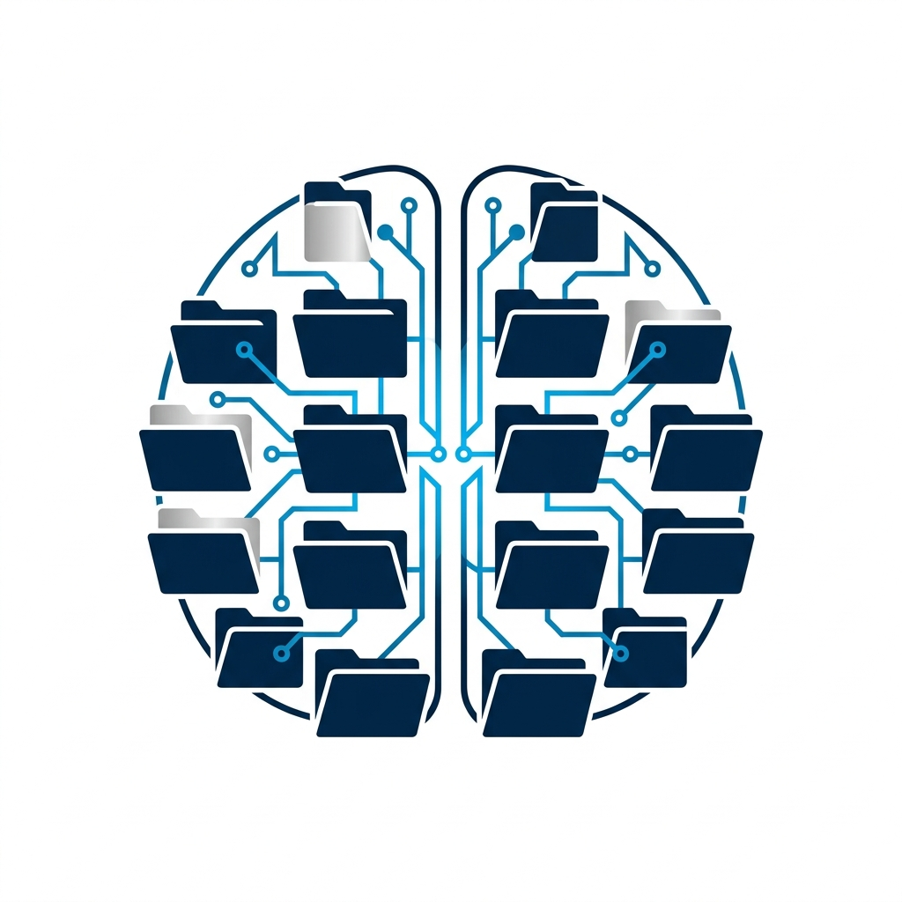

# Second Brain CLI

<p align="center">
  
</p>

A small **Python CLI** that connects a **local [Ollama](https://ollama.com/)** model to a **Markdown vault**: a directory tree of `.md` notes (and images or other assets beside them). You chat in the terminal; the model can list folders, read and edit notes, search, follow wikilinks, and (with a vision-capable model) describe images in the vault.

The vault is just a folder on disk — no specific app is required. Popular setups include **Obsidian**, Logseq, Zettlr, or a plain `git` repo of Markdown files.

Everything runs on your machine: no cloud API keys required for the default setup.

## Features

- **Local LLM** via Ollama (`chat` with tools, optional streaming).
- **Vault-scoped tools**: directory listing, read/create/edit/move/rename/delete notes, search, tags, backlinks, frontmatter updates, image read (OCR/describe).
- **Session persistence**: optional resume from a JSON history file stored under the vault path (configurable filename).
- **Rolling context summary**: when the conversation exceeds the configured window, older turns can be compressed into one assistant message instead of being discarded (see `brain/defaults.py` → `ContextCompression`; disable in tests via `context_compression.enabled` if you fork defaults).
- **Rich terminal UI** when `rich` is installed (graceful fallback to plain text): panels for answers, a wait indicator while the model streams (no duplicate streamed text), and shortened logs for very long `create_note` / `edit_note` bodies.

## Requirements

- **Python** 3.10 or newer (3.12+ recommended).
- **[Ollama](https://ollama.com/)** installed and running, with at least one **chat** model pulled (e.g. `ollama pull gemma4`).
- Python packages listed in **`requirements.txt`** (`ollama`, `rich`, `PyYAML`).

## Quick start

1. **Clone** this repository and enter the project directory.

2. **Create a virtual environment** (recommended) and install dependencies:

   ```bash
   python -m venv .venv
   source .venv/bin/activate   # Windows: .venv\Scripts\activate
   pip install -r requirements.txt
   ```

3. **Copy** `second_brain_user.example.json` to **`second_brain_user.json`** next to `agent.py`.

4. **Edit** `second_brain_user.json`: set **`vault_path`** to the root folder of your notes (the directory that contains your `.md` files and any subfolders you use). Set **`ollama_model`** to a model you have pulled.

5. **Start Ollama**, then run:

   ```bash
   python agent.py
   ```

If `second_brain_user.json` is missing, the app still starts but uses factory defaults and may treat the script directory as the vault until you configure `vault_path`.

## Configuration (`second_brain_user.json`)

| Key | Description |
| --- | --- |
| `vault_path` | Absolute or user-relative path to your Markdown vault root **(required for real use)**. |
| `ollama_host` | Ollama API base URL (default `http://127.0.0.1:11434`). |
| `ollama_model` | Default chat model tag (e.g. `gemma4:latest`; use whatever you have pulled). |
| `ollama_vision_model` | Optional; if empty, `read_image` falls back to `ollama_model` (see below). |
| `history_filename` | Session file name (default `.agent_history.json`, resolved under the vault path). |
| `note_encoding` | Text encoding for note I/O (default `utf-8`). |
| `system_prompt` | Optional. When non-empty, **replaces** the entire built-in system prompt. Leave empty to keep the default vault-assistant instructions. |
| `vault_instructions` | Optional. **Appended** after the effective system text (built-in or `system_prompt`). Use for editor-specific rules (e.g. plugins), link conventions, or how *your* vault is organized — without discarding the generic tool behaviour. |
| `log_level` | e.g. `DEBUG`, `INFO`, `WARNING` (default effective level is `WARNING`). |
| `log_file` | Optional path for `brain` logger file output. |

Keys starting with **`_`** are ignored by the loader (handy for comments in JSON).

**Config file location** (first match wins if you pass `--config`):

1. Path given with **`--config`**
2. Environment variable **`SECOND_BRAIN_USER_CONFIG`**
3. **`./second_brain_user.json`** next to `agent.py`

## Command-line interface

```text
python agent.py [--config FILE] [--resume] [--think] [--vision-model MODEL]
                  [--host URL] [--model NAME]
```

| Flag | Purpose |
| --- | --- |
| `--config` | Path to your user JSON. |
| `--resume` | Load prior non-system messages from the session file. |
| `--think` | Pass extended thinking to Ollama when the client and model support it. |
| `--vision-model` | Override the model used for `read_image` for this run only. |
| `--host` | Override `ollama_host` for this run. |
| `--model` | Override `ollama_model` for this run. |

## Environment variables

| Variable | Purpose |
| --- | --- |
| `SECOND_BRAIN_USER_CONFIG` | Path to `second_brain_user.json` when not using `--config`. |
| `OLLAMA_VISION_MODEL` | Highest-priority override for the vision model used by `read_image`. |

Precedence for the vision model is: **`OLLAMA_VISION_MODEL`** → **`--vision-model`** → **`ollama_vision_model`** in JSON → **`ollama_model`**. Leaving `ollama_vision_model` empty is fine if your **main** model supports images.

## Slash commands (REPL)

Inside the chat loop:

- `/help` — show commands
- `/clear` — clear in-memory history and delete the session file
- `/history` — show how many messages are in the rolling context
- `/search <term>` — quick vault text search without invoking the model
- `/exit` — save and exit (aliases: `/quit`, `/bye`)

## Development

Install dev dependencies and run tests:

```bash
pip install -r requirements-dev.txt
python -m pytest tests/ -v
```

## Security notes

- Tools only access paths **inside** the configured vault (path traversal is rejected).
- **`delete_note`** requires an explicit `confirm=true` argument after the user has agreed; accidental deletion by a bare tool call is blocked by design.